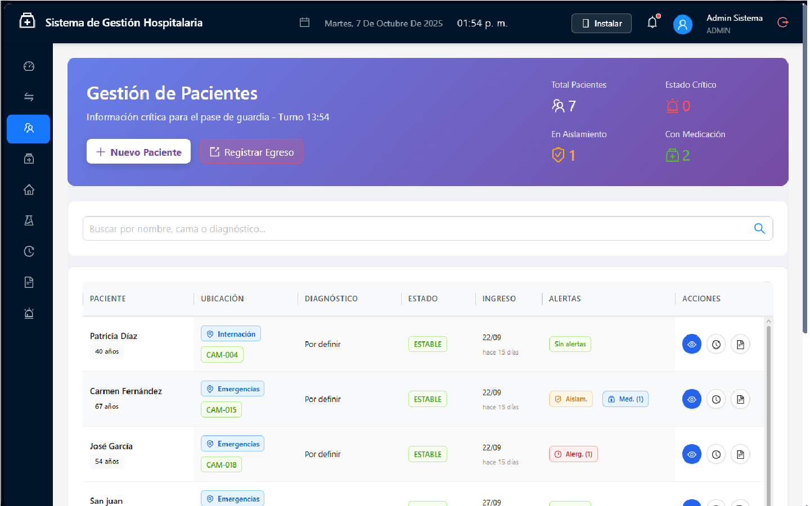
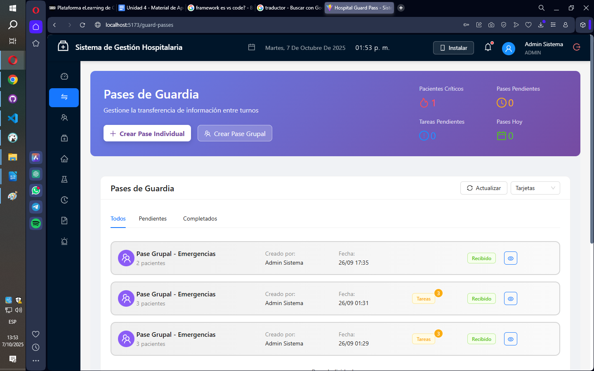
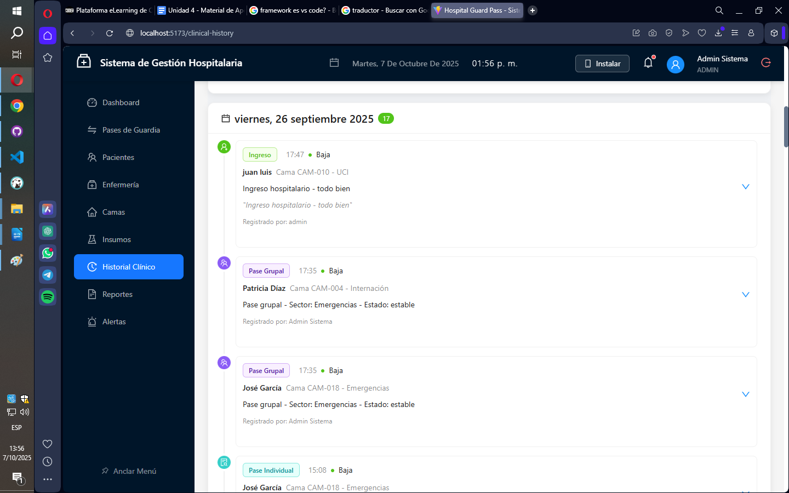

# 📚 Documentación - Sistema de Pases de Guardia Hospitalaria

## 🖼️ Capturas de Pantalla Desktop

### Dashboard Principal


### Gestión de Pacientes


### Pase de Guardia (Protocolo ISBAR)


### Historial Clinico



## 🖼️ Capturas de Pantalla Mobile

....

## Documentación Técnica

### 🔧 Para Desarrolladores
- [**API Documentation**](API-DOCUMENTATION.md) - Endpoints, autenticación, ejemplos
- [**Technical Specifications**](TECHNICAL-SPECIFICATIONS.md) - Arquitectura, stack, requerimientos
- [**DEVELOPMENT.md**](../DEVELOPMENT.md) - Guía de desarrollo y convenciones

### 🏥 Para Profesionales de Salud
- [**Medical Data Dictionary**](MEDICAL-DATA-DICTIONARY.md) - Terminología médica, protocolos ISBAR, estándares

## Guías Rápidas

### 🚀 Instalación
```bash
# Backend
cd backend
npm install
cp .env.example .env
npm run db:migrate
npm run db:seed
npm run dev

# Frontend
cd ../frontend
npm install
npm run dev
```

### 👤 Usuario Demo
- **Usuario**: admin
- **Contraseña**: admin123

### 📱 Acceso Móvil
1. Verificar IP local: `ipconfig` (Windows) o `ifconfig` (Linux/Mac)
2. Desde el móvil: `http://TU_IP:5173`
3. Instalar como app desde el navegador

## Estructura del Proyecto

```
Hospital-Guard-Pass/
├── 📁 frontend/          # React PWA
├── 📁 backend/           # Node.js API
├── 📁 docs/              # Esta documentación
├── 📄 README.md          # Inicio rápido
└── 📄 CLAUDE.md          # Guía técnica detallada
```

## Módulos Principales

1. **🏠 Dashboard** - Métricas en tiempo real
2. **🔄 Pases de Guardia** - Protocolo ISBAR
3. **👥 Pacientes** - Gestión integral
4. **👩‍⚕️ Enfermería** - Personal y asignaciones
5. **🛏️ Camas** - Control visual
6. **💊 Insumos** - Inventario médico
7. **📊 Reportes** - Estadísticas y auditoría

## Características Destacadas

- ✅ **PWA** - Funciona en cualquier dispositivo
- ✅ **Offline** - Sin conexión a internet
- ✅ **Real-time** - Actualización instantánea
- ✅ **Seguro** - Encriptación y auditoría
- ✅ **ISBAR** - Protocolo internacional

## Soporte

- 📧 Email: [Pendiente configurar]
- 📖 Wiki: [En desarrollo]
- 🐛 Issues: [GitHub Issues](../../issues)

---

*Última actualización: Enero 2025*